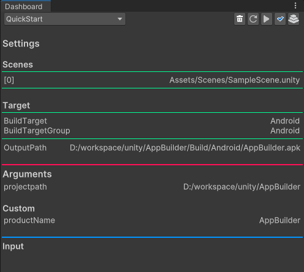

AppBuilder
==

## Table of Contents

- [Getting started](#getting-started)
- [Dashboard](#dashboard)
- [Attributes](#attributes-for-dashboard)
- [AppSettings](#appsettings)
- [IBuildContext](#ibuildcontext)
  - [GetConfiguration\<T>](#getconfigurationt)
  - [GetSection\<T>, GetSections\<T>](#getsectiont-getsectionst)
- [Platform Configure](#platform-configure)
  

Getting started
---

Unity PackageManager > Add package from git URL

`https://github.com/qkrsogusl3/AppBuilder.git?path=/Package`

```csharp
namespace Builds
{
    public static class UseCase
    {
        // Tool에 빌드 함수 전달
        [Build]
        public static void QuickStart()
        {
            //(IBuildContext, IUnityPlayerBuilder)
            BuildPlayer.Build((ctx, builder) =>
            {
                //현재 에디터 세팅으로 설정
                builder.ConfigureCurrentSettings();
            });
        }
    }
}
```
```zsh
./Unity.exe -executeMethod "Builds.UseCase.QuickStart" ...
```

Dashboard
---
AppBuilder > Dashboard



* Dropdown 
  * [Build] 속성이 있는 빌드 메소드

* Toolbar
  * PlayerPrefs.DeleteAll()
  * Reload
  * Configure & Play
  * Configure Only
  * Build

* Section
  * Settings
    - Configure 시 적용되는 세팅 프리뷰
  * Arguments
    - CommandLine에서 AppBuilder로 전달되는 Argument. 
    - Configure시 BuildContext에서 접근가능.
    - Custom
      - 전달된 Argument에 임의로 추가한 Argument.
    - Input
      - 각 빌드별로 필요한 Argument.
      - 전달된 Argument들로 Formatting.
      > ex. /custom/{productName}-{variant}  

Attributes (for Dashboard)
---

```csharp
[Build("Attributes Example")]
[AppSettings]
[Variant("Development", "Production", "GooglePlay", "GooglePlay.Dev")]
[Directory("outputPath")]
[File("keystore", "keystore")]
[Input("keystore.passwd")]
[Input("keystore.alias", "alias")]
[Input("keystore.alias.passwd")]
public static void Attributes()
{
    BuildPlayer.Build((ctx, builder) => { builder.ConfigureCurrentSettings(); });
}
```
* Build
  * Build Method
  * (DisplayName)
* Input
  * Input Argument
  * CommandLine으로 전달할 Argments를 Dashboard에서 테스트 가능  
  * [AppSettings](#appsettings)
    * `-appsettings "directory"`
    * appsettings.json의 Directory
  * Variant (...variants)
    * `-variant "Name"`
    * [override appsettings.json](#appsettings)
    > ex. appsettings.{variant}.json
  * Directory
    * Add 'OpenFolderPanel' Button
  * File (name, extension)
    * Add 'OpenFilePanel' Button


AppSettings
---
* appsettings.json을 구성 설정에 사용가능
* override variant
  * -variant 값을 사용해서 appsettings.json을 override
  > ex. -variant "Dev" -> appsettings.Dev.json
* use [IBuildContext](#ibuildcontext)


IBuildContext
---
### GetConfiguration\<T>

#### Basic
> appsettings.json
```json
{
    "Host": "127.0.0.1",
    "PackageName" : "com.sample.packagename"
}
```
```csharp
public class Config
{
    public string Host;
    public string PackageName;
}

BuildPlayer.Build((ctx, builder) =>
{
    //...
    IOption<Config> appsettings = ctx.GetConfiguration<Config>();
});

```
#### UseRuntime (ScriptableObject)
```csharp
public class ConfigScriptableObject : OptionsScriptableObject<Config>{}

//...
IOption<Config> appsettings = ctx.GetConfiguration<Config>().WriteScriptable("Resources/Path");
```

### GetSection\<T>, GetSections\<T>
> appsettings.json
```json
{
    "host": "127.0.0.1",
    "title": { "logo": "Image/Bg/title_2" },
    "titles": [
        { "logo": "title_2" },
        { "logo": "title_2_3" },
        { "logo": "title_2_4" }
    ],
    "number": 192,
    "numbers": [ 1, 2, 3, 4, 5 ],
    "strings": [ "str1", "str2", "str3", "str4", "str5", "str6" ]
}
```
```csharp
public class TitleConfig
{
    public string logo;

    public override string ToString() => $"title.logo: {logo}";
}

BuildPlayer.Build((ctx, builder) =>
{
    builder.ConfigureCurrentSettings();

    var host = ctx.GetSection<string>("host");
    var title = ctx.GetSection<TitleConfig>("title");
    var titles = ctx.GetSections<TitleConfig>("titles");
    var number = ctx.GetSection<int>("number");
    var numbers = ctx.GetSections<int>("numbers");
    var strings = ctx.GetSections<string>("strings");
});
```

Platform Configure
---
`builder.Configure~`
```csharp
builder.ConfigureAndroid(android=>{});
builder.ConfigureIOS(ios=>{});
//...
```